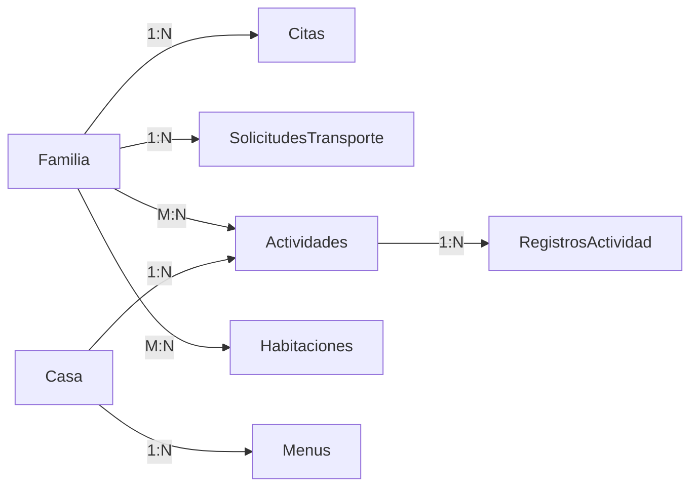

# Arquitectura Técnica — mcFaro

> Documentación de la arquitectura, tecnologías y decisiones de diseño del sistema

---

## 📚 Tabla de Contenidos

1. [Stack Tecnológico](#stack-tecnológico)
2. [Arquitectura del Sistema](#arquitectura-del-sistema)
3. [Modelo de Datos](#modelo-de-datos)
4. [Flujo de Información](#flujo-de-información)
5. [Seguridad y Privacidad](#seguridad-y-privacidad)
6. [Escalabilidad](#escalabilidad)

---

## 🛠️ Stack Tecnológico

### Framework y Runtime

| Tecnología | Versión | Uso en mcFaro |
|------------|---------|---------------|
| **Next.js** | 16.2.2 | App Router, Server/Client Components, API routes |
| **React** | 19.2.4 | UI declarativa, hooks personalizados |
| **TypeScript** | ^5.0 | Type safety, detección de errores en desarrollo |
| **Node.js** | 18+ | Runtime del servidor, API endpoints |

#### ✅ Justificación de Next.js + React

**¿Por qué Next.js sobre Create React App o Vite?**

1. **Server-Side Rendering (SSR):**
   - Primera carga más rápida (crítico para conexiones lentas en hospitales)
   - SEO mejorado para landing page pública
   - Mejor experiencia en dispositivos de gama baja

2. **API Routes integradas:**
   - No requiere servidor Express separado
   - Endpoints serverless (`/api/*`) para proteger Firebase Admin SDK
   - Deploy unificado (frontend + backend en un solo proyecto)

3. **App Router (RSC):**
   - React Server Components reducen JavaScript en el cliente
   - Componentes sin `"use client"` no envían código al navegador
   - Layouts anidados evitan re-renders innecesarios

4. **Optimizaciones automáticas:**
   - Code splitting por ruta
   - Image optimization (`next/image`)
   - Font optimization (Google Fonts con preload)

**¿Por qué TypeScript?**
- Previene bugs en producción (null checks, tipos incorrectos)
- IntelliSense mejora velocidad de desarrollo
- Documentación implícita (tipos describen la API)

---

### Estilos y UI

| Tecnología | Versión | Uso en mcFaro |
|------------|---------|---------------|
| **Tailwind CSS** | ^4.0 | Utility-first styling, responsive design |
| **Lucide React** | ^1.7.0 | Iconos SVG consistentes y livianos |
| **GSAP** | ^3.14.2 | Animaciones complejas (landing story) |

#### ✅ Justificación de Tailwind CSS

**¿Por qué Tailwind sobre CSS Modules o Styled Components?**

1. **Velocidad de desarrollo:**
   - No cambiar entre archivos (HTML y CSS en el mismo lugar)
   - No inventar nombres de clases (`btn-primary-large-disabled`)
   - Consistencia automática (espaciados, colores, breakpoints)

2. **Performance:**
   - CSS purging automático (elimina estilos no usados)
   - Sin runtime JavaScript (vs. styled-components)
   - Bundle final ~20KB (vs. ~50KB+ de CSS-in-JS)

3. **Responsive design simplificado:**
   ```jsx
   className="text-sm md:text-base lg:text-lg"
   // Mobile: 14px, Tablet: 16px, Desktop: 18px
   ```

4. **Accesibilidad:**
   - Plugins de accesibilidad (contraste, focus visible)
   - Utilities para screen readers (`sr-only`)

---

### Backend y Base de Datos

| Tecnología | Versión | Uso en mcFaro |
|------------|---------|---------------|
| **Firebase Firestore** | ^12.11.0 | Base de datos NoSQL en tiempo real |
| **Firebase Auth** | ^12.11.0 | Autenticación por teléfono (OTP) |
| **Firebase Cloud Messaging** | Admin SDK ^13.7.0 | Notificaciones push |
| **Firebase Admin SDK** | ^13.7.0 | Operaciones privilegiadas (server-only) |

#### ✅ Justificación de Firebase

**¿Por qué Firebase sobre PostgreSQL + Express + custom backend?**

1. **Tiempo de desarrollo:**
   - Firebase reduce 80% del código backend
   - No requiere ORM (Prisma, TypeORM)
   - No requiere migración de esquemas

2. **Offline-first nativo:**
   - Firestore tiene persistencia offline automática
   - Sincronización automática al reconectar
   - Queries funcionan con cache local

3. **Real-time por defecto:**
   - `onSnapshot` escucha cambios en tiempo real
   - No requiere WebSockets manuales
   - Escalado automático de conexiones

4. **Seguridad declarativa:**
   - Firestore Security Rules (no código imperativo)
   - Validación de permisos en el servidor
   - Audit logs automáticos

5. **Escalabilidad sin configuración:**
   - Autoescalado horizontal
   - Replicación multi-región
   - Backups automáticos

**¿Por qué Firebase Auth sobre JWT custom?**
- SMS OTP integrado (no requiere Twilio)
- reCAPTCHA anti-fraude incluido
- Refresh tokens automáticos
- SDKs nativos para iOS/Android (futuro)

**Limitaciones conocidas:**
- Queries complejas requieren índices (creación manual)
- Costo puede crecer con escala (mitigado con caching)
- Vendor lock-in (mitigado con abstracción en hooks)

---

### IA y Generación de Contenido

| Tecnología | Versión | Uso en mcFaro |
|------------|---------|---------------|
| **Google Gemini API** | ^0.24.1 | Generación de rutinas diarias (futuro) |

#### ✅ Justificación de Gemini

**¿Por qué Gemini sobre OpenAI GPT-4 o Claude?**

1. **Costo:**
   - Gemini 2.0 Flash: $0.075 / 1M tokens (entrada)
   - GPT-4 Turbo: $10.00 / 1M tokens (20x más caro)
   - Claude Sonnet: $3.00 / 1M tokens (40x más caro)

2. **Velocidad:**
   - Flash optimizado para latencia baja (<2s respuesta)
   - Crítico para UX fluida en generación de rutinas

3. **Integración Google:**
   - Créditos GCP via Google for Nonprofits
   - Mismo ecosistema que Firebase

4. **Contexto largo:**
   - 1M tokens de contexto (puede incluir historial completo)

**Caso de uso en mcFaro:**
```typescript
const rutina = await generarRutina({
  citas: [{hora: "10:00", hospital: "INP"}],
  comidas: [{tipo: "desayuno", hora: "08:00"}],
  tipoTratamiento: "oncologia"
});
// Retorna: JSON con bloques horarios personalizados
```

---

### PWA y Offline

| Tecnología | Versión | Uso en mcFaro |
|------------|---------|---------------|
| **next-pwa** | (en plan) | Service Workers, manifest.json |
| **Firebase IndexedDB** | Nativo | Cache local de Firestore |

#### ✅ Justificación de PWA

**¿Por qué PWA sobre app nativa (React Native, Flutter)?**

1. **Distribución:**
   - PWA: Instalar desde navegador (sin App Store)
   - Crítico: muchas familias tienen espacio limitado
   - QR en recepción → instalación inmediata

2. **Actualizaciones:**
   - PWA: updates automáticos sin aprobación de tienda
   - Hotfixes en <5 minutos

3. **Costo de desarrollo:**
   - PWA: 1 codebase (web = mobile)
   - Nativa: 2-3 codebases (iOS, Android, web)

4. **Offline-first:**
   - Service Workers cachean assets estáticos
   - Firestore cachea datos dinámicos
   - Funcionamiento completo sin red

**Limitaciones conocidas:**
- iOS: soporte PWA limitado (sin push notifications en Safari)
- Android: experiencia casi nativa

---

### Librerías Auxiliares

| Librería | Versión | Uso en mcFaro |
|----------|---------|---------------|
| **date-fns** | ^4.1.0 | Manipulación de fechas (locale español) |
| **libphonenumber-js** | ^1.12.41 | Validación y formato de números telefónicos |
| **Zod** | ^4.3.6 | Validación de esquemas (forms, API) |
| **html5-qrcode** | ^2.3.8 | Scanner QR (check-in coordinador) |
| **react-qr-code** | ^2.0.18 | Generador QR (credencial digital) |

---

## 🏗️ Arquitectura del Sistema

### Capas del Sistema

```
┌─────────────────────────────────────────────────────┐
│  CAPA DE PRESENTACIÓN (Client Components)          │
│  ├─ Pages (app/*/page.tsx)                         │
│  ├─ Components (components/*/*)                    │
│  └─ Layouts (app/*/layout.tsx)                     │
└──────────────────┬──────────────────────────────────┘
                   │ useAuth, useCitas, etc.
┌──────────────────▼──────────────────────────────────┐
│  CAPA DE ESTADO (Custom Hooks + Contexts)          │
│  ├─ useAuth() → Firebase Auth + Firestore          │
│  ├─ useCitas() → Real-time listeners               │
│  ├─ useDashboard() → Agregación de datos           │
│  └─ SidebarContext → Estado global                 │
└──────────────────┬──────────────────────────────────┘
                   │ fetch, addDoc, updateDoc
┌──────────────────▼──────────────────────────────────┐
│  CAPA DE API (Next.js API Routes)                  │
│  ├─ /api/notificaciones → FCM push                 │
│  ├─ /api/actividades → Validaciones server-side    │
│  └─ /api/transporte → Lógica de negocio            │
└──────────────────┬──────────────────────────────────┘
                   │ Admin SDK, Gemini API
┌──────────────────▼──────────────────────────────────┐
│  CAPA DE SERVICIOS (Firebase)                      │
│  ├─ Authentication (Phone OTP)                      │
│  ├─ Firestore (Real-time DB)                       │
│  ├─ Cloud Messaging (Push)                         │
│  └─ (Futuro) Cloud Functions (Cron jobs)           │
└─────────────────────────────────────────────────────┘
```

---

### Estructura de Carpetas

```
mcfaro-hackatoon/
├── app/                          # Next.js App Router
│   ├── (auth)/                   # Grupo de rutas: login/onboarding
│   │   ├── login/page.tsx
│   │   ├── onboarding/page.tsx
│   │   └── layout.tsx
│   │
│   ├── (app)/                    # Grupo de rutas: área autenticada
│   │   ├── layout.tsx            # Layout con BottomNav + protección
│   │   ├── dashboard/page.tsx
│   │   ├── calendario/page.tsx
│   │   ├── menu/page.tsx
│   │   ├── actividades/page.tsx
│   │   ├── transporte/page.tsx
│   │   ├── recursos/page.tsx
│   │   ├── mapa/page.tsx
│   │   ├── perfil/page.tsx
│   │   ├── comunidad/page.tsx
│   │   │
│   │   └── coordinador/          # Panel del staff (role-based)
│   │       ├── page.tsx
│   │       ├── familias/page.tsx
│   │       ├── habitaciones/page.tsx
│   │       └── ...
│   │
│   ├── api/                      # API Routes (server-only)
│   │   ├── notificaciones/route.ts
│   │   ├── actividades/route.ts
│   │   └── transporte/route.ts
│   │
│   └── layout.tsx                # Root layout + providers
│
├── components/                   # Componentes reutilizables
│   ├── ui/                       # Componentes base
│   │   ├── Button.tsx
│   │   ├── BottomNav.tsx
│   │   ├── Toast.tsx
│   │   └── Skeleton.tsx
│   │
│   ├── dashboard/                # Widgets del dashboard
│   ├── calendario/               # Componentes del calendario
│   ├── menu/                     # Componentes del menú
│   └── ...
│
├── hooks/                        # Custom hooks
│   ├── useAuth.ts
│   ├── useCitas.ts
│   ├── useDashboard.ts
│   └── ...
│
├── contexts/                     # React Contexts
│   └── SidebarContext.tsx
│
├── lib/                          # Utilidades y configuración
│   ├── firebase.ts               # Cliente Firebase (browser)
│   ├── firebase-admin.ts         # Admin SDK (server-only)
│   ├── types.ts                  # Contratos de datos
│   └── notificaciones.ts         # Helpers FCM
│
├── public/                       # Assets estáticos
│   ├── manifest.json
│   ├── sw.js
│   └── icons/
│
└── docs/                         # Documentación
    ├── VISION.md
    ├── ARCHITECTURE.md
    ├── COMPONENTS.md
    └── API.md
```

---

## 💾 Modelo de Datos

### Colecciones de Firestore

#### `familias/{uid}`

```typescript
{
  id: string,                      // Firebase Auth UID
  nombreCuidador: string,
  nombreNino: string,
  telefono: string,
  email?: string,
  hospital: string,
  fechaIngreso: Timestamp,
  fechaSalida?: Timestamp,
  casaRonald: string,              // "cdmx", "puebla", etc.
  habitacion?: string,             // "205A"
  tipoTratamiento: string,         // Texto libre (NO código médico)
  rol: "cuidador" | "coordinador",
  activa: boolean,
  fcmToken?: string,               // Token para push notifications
  cuidadores?: Cuidador[],         // Cuidadores adicionales
  creadaEn: Timestamp
}
```

**Índices necesarios:**
- `casaRonald` (simple)
- `casaRonald + activa` (compuesto)

---

#### `citas/{id}`

```typescript
{
  id: string,
  familiaId: string,
  titulo: string,
  descripcion?: string,
  fecha: Timestamp,
  servicio: "consulta" | "estudio" | "procedimiento" | "otro",
  ubicacion?: string,
  notas?: string,
  completada: boolean,
  recordatorio60: boolean,
  recordatorio15: boolean,
  notificacionEnviada: boolean,
  creadaEn: Timestamp
}
```

**Índices necesarios:**
- `familiaId + fecha` (compuesto)

---

#### `menus/{YYYY-MM-DD-casaRonald}`

```typescript
{
  id: string,                      // "2026-04-08-cdmx"
  fecha: string,                   // "2026-04-08"
  casaRonald: string,
  comidas: {
    desayuno: {
      hora: "08:00",
      descripcion: string,
      disponible: boolean,
      notificadaEn?: Timestamp
    },
    comida: {...},
    cena: {...}
  },
  publicadoPor: string,            // familiaId coordinador
  publicadoEn: Timestamp
}
```

**Diseño clave:**
- ID compuesto (`fecha-casa`) previene duplicados naturalmente
- Query directo sin `where` (más rápido offline)

---

#### `actividades/{id}`

```typescript
{
  id: string,
  titulo: string,
  descripcion: string,
  tipo: "arte" | "deporte" | "educacion" | "bienestar" | "recreacion" | "otro",
  fechaHora: Timestamp,
  duracionMin: number,
  capacidadMax: number,
  instructor: string,
  ubicacion: string,
  estado: "programada" | "en_curso" | "completada" | "cancelada",
  casaRonald: string,
  registrados: number,
  creadaPor: string,
  creadaEn: Timestamp
}
```

---

#### `solicitudesTransporte/{id}`

```typescript
{
  id: string,
  familiaId: string,
  nombreCuidador: string,
  origen: string,
  destino: string,
  fechaHora: Timestamp,
  pasajeros: number,
  notas?: string,
  estado: "pendiente" | "asignada" | "en_camino" | "completada" | "cancelada",
  unidadId?: string,
  placasUnidad?: string,
  nombreChofer?: string,
  creadaEn: Timestamp,
  actualizadaEn: Timestamp
}
```

---

### Relaciones entre Colecciones



---

## 🔄 Flujo de Información

### Autenticación: Login → Dashboard

```
1. Usuario ingresa teléfono
   ↓
2. Firebase Auth envía SMS OTP
   ↓
3. Usuario ingresa código
   ↓
4. confirmationResult.confirm(codigo)
   ↓
5. onAuthStateChanged detecta usuario
   ↓
6. onSnapshot(familias/{uid}) carga datos
   ↓
7. Router push a /dashboard
   ↓
8. Dashboard consume useAuth() + useDashboard()
   ↓
9. 4 queries Firestore paralelas (citas, menu, actividades, transporte)
   ↓
10. Widgets renderizan con datos reales
```

---

### Notificación Push: Cita Próxima

```
1. Cita creada con recordatorio60: true
   ↓
2. [Futuro] Cloud Function scheduled(citas/{id})
   ↓
3. Cron job verifica citas con fechaEn < 60min
   ↓
4. POST /api/notificaciones/enviar
   ↓
5. getMessaging().send({ token, notification })
   ↓
6. FCM entrega push al dispositivo
   ↓
7. Service Worker intercepta (background)
   ↓
8. Usuario hace clic → abre /calendario
```

---

### Modo Offline: Consultar Citas

```
1. Usuario pierde conexión
   ↓
2. useOnlineStatus() detecta → banner amarillo
   ↓
3. useCitas() query a Firestore
   ↓
4. Firestore retorna cache local (IndexedDB)
   ↓
5. UI renderiza con datos cacheados
   ↓
6. [Al reconectar] Firestore sincroniza automáticamente
   ↓
7. onSnapshot emite nuevo evento → UI actualiza
```

---

## 🔒 Seguridad y Privacidad

### Principios de Seguridad

#### 1. **No Almacenar Datos Clínicos Sensibles**

✅ **Permitido:**
- Nombre del niño
- Hospital donde se atiende (nombre genérico)
- Tipo de tratamiento (texto libre, NO código ICD-10)
- Citas logísticas (hora, ubicación)

❌ **Prohibido:**
- Diagnósticos médicos específicos
- Resultados de estudios
- Nombres de medicamentos
- Historial médico detallado
- Datos genéticos

**Justificación:**
- mcFaro es una herramienta **operativa**, no clínica
- Evita responsabilidad legal (LFTAIP, NOM-024-SSA3)
- Reduce riesgo de brechas de datos sensibles

---

#### 2. **Firestore Security Rules**

```javascript
// Producción
rules_version = '2';
service cloud.firestore {
  match /databases/{database}/documents {

    // Familias: solo lectura/escritura propia
    match /familias/{uid} {
      allow read, write: if request.auth.uid == uid;

      // Coordinadores pueden leer familias de su casa
      allow read: if request.auth.token.rol == "coordinador"
                  && resource.data.casaRonald == request.auth.token.casaRonald;
    }

    // Citas: solo del usuario o coordinador de su casa
    match /citas/{citaId} {
      allow read: if request.auth.uid == resource.data.familiaId
                  || (request.auth.token.rol == "coordinador"
                      && getFamily(resource.data.familiaId).casaRonald == request.auth.token.casaRonald);

      allow create, update: if request.auth.uid == request.resource.data.familiaId;
      allow delete: if request.auth.uid == resource.data.familiaId;
    }

    // Menus: lectura pública, escritura solo coordinador
    match /menus/{menuId} {
      allow read: if request.auth != null;
      allow write: if request.auth.token.rol == "coordinador";
    }
  }
}
```

---

#### 3. **API Routes Protegidas**

```typescript
// app/api/notificaciones/route.ts
export async function POST(req: Request) {
  // Validar Authorization header
  const authHeader = req.headers.get("Authorization");
  if (!authHeader?.startsWith("Bearer ")) {
    return NextResponse.json({ error: "Unauthorized" }, { status: 401 });
  }

  // Verificar token con Admin SDK
  const token = authHeader.split("Bearer ")[1];
  const decodedToken = await adminAuth.verifyIdToken(token);

  // Validar rol
  if (decodedToken.rol !== "coordinador") {
    return NextResponse.json({ error: "Forbidden" }, { status: 403 });
  }

  // Procesar request...
}
```

---

#### 4. **Encriptación en Tránsito y Reposo**

- **HTTPS obligatorio:** Firebase Hosting fuerza TLS 1.3
- **Firestore encryption at rest:** Automático (AES-256)
- **Firebase Auth tokens:** JWT firmados con RS256

---

### Cumplimiento Normativo

#### México (LFTAIP)

- **Transparencia:** Terms of Service explica qué datos se almacenan
- **Derecho de acceso:** Usuario puede descargar sus datos desde `/perfil`
- **Derecho de rectificación:** Usuario puede editar datos desde `/perfil`
- **Derecho de supresión:** Coordinador puede desactivar familia

#### GDPR (Futuro - Expansión EU)

- **Consentimiento explícito:** Durante onboarding
- **Data portability:** Export JSON desde perfil
- **Right to be forgotten:** Endpoint `DELETE /api/familia/{id}`

---

## 📈 Escalabilidad

### Escalabilidad Horizontal (Firestore)

**Capacidad actual (Firebase Spark - Free):**
- 50,000 lecturas/día
- 20,000 escrituras/día
- 1 GB almacenamiento

**Capacidad con Blaze (Pay-as-you-go):**
- Ilimitado (con costo)
- ~$0.06 / 100K lecturas
- ~$0.18 / 100K escrituras

**Estimación de carga (100 familias activas):**
- 100 familias × 10 queries/día = 1,000 lecturas
- 100 familias × 2 escrituras/día = 200 escrituras
- **Costo mensual estimado:** <$5 USD

**Con 1,000 familias:**
- 10,000 lecturas/día + 2,000 escrituras/día
- **Costo mensual estimado:** ~$30 USD

---

### Multi-Tenancy por Casa

**Estrategia:**
- Campo `casaRonald` en todas las colecciones
- Security Rules filtran por casa
- Datos completamente aislados

**Ventajas:**
- Escalabilidad lineal (agregar casa = agregar campo)
- Privacidad garantizada entre casas
- Analytics separados por región

**Alternativa futura:**
- Proyectos Firebase separados por país/región
- Firestore multi-region para latencia baja

---

### CDN y Caching

**Firebase Hosting:**
- CDN global automático
- Assets estáticos cacheados por 1 año
- Purge manual de cache vía CLI

**Next.js ISR (Incremental Static Regeneration):**
- Páginas estáticas regeneradas cada 60s
- Reduce carga en Firestore

---

## 🔍 Monitoreo y Observabilidad (Futuro)

### Métricas Clave

1. **Performance:**
   - Time to First Byte (TTFB) <500ms
   - Largest Contentful Paint (LCP) <2.5s
   - Cumulative Layout Shift (CLS) <0.1

2. **Errores:**
   - Error rate <1%
   - Firebase Auth failures <0.5%
   - API route errors <2%

3. **Uso:**
   - DAU (Daily Active Users)
   - Citas creadas/día
   - Push notifications enviadas/día

### Herramientas

- **Firebase Performance Monitoring:** Automático en SDK
- **Google Analytics 4:** User behavior tracking
- **Sentry / Rollbar:** Error tracking
- **Custom logging:** `lib/logger.ts`

---

## 📌 Conclusión

La arquitectura de mcFaro está diseñada para:

- ✅ **Rapidez de desarrollo:** Firebase + Next.js reducen 80% del código backend
- ✅ **Escalabilidad:** Arquitectura serverless escala automáticamente
- ✅ **Resiliencia:** Offline-first con sincronización automática
- ✅ **Seguridad:** No almacena datos clínicos, Security Rules robustas
- ✅ **Costo-efectividad:** <$50 USD/mes para 1,000 familias

El stack elegido permite a la Fundación Ronald McDonald **mantener, escalar y evolucionar la plataforma con mínima inversión operacional**.

---

**Documentación relacionada:**
- [Visión y Problemática](./VISION.md)
- [Componentes y Flujos](./COMPONENTS.md)
- [API y Servicios](./API.md)
